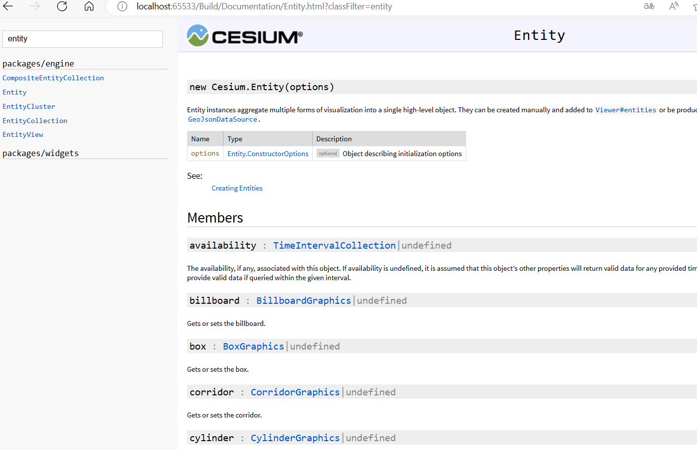
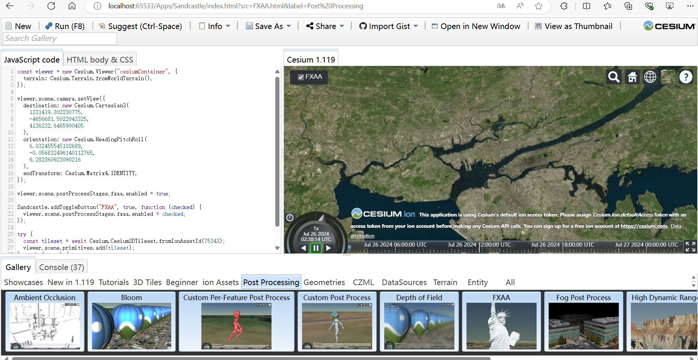

# Vue 3 + Vite + Cesium 学习过程记录
🦊cesium + vue3 参考官网的学习记录，也是方便自己以后复习（🎃copy现成代码片段✌️）。

# link
- [cesium 中文网](http://cesium.xin)
- [cesium 官网](https://cesium.com/)
- [cesium 中文文档](http://cesium.xin/cesium/cn/Documentation1.62/)，目前最新的1.119版本，但是中文文档只到1.62🙂

# usage
1. run ``` pnpm install ```
2. 把每一个`src_`开头的文件夹改为`src`
3. 控制台运行 ```pnpm dev``` 即可


# 搭建官方本地文档
1. 下载官方relese 包
2. 使用本地静态服务器(`js` 使用`http-server` | `servez`,  `python`使用```python -m http.server```)


