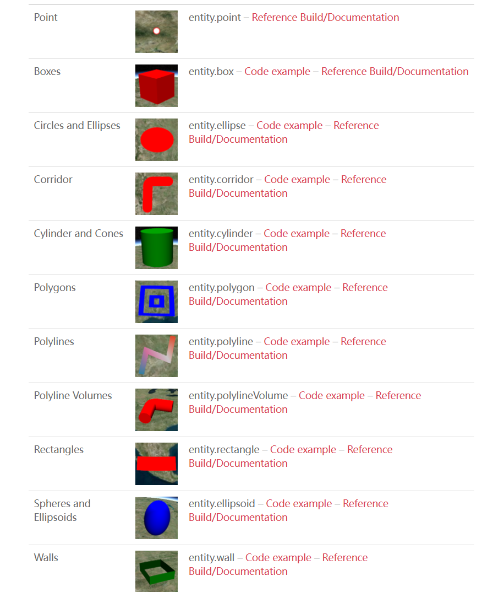

# 添加实体
## 通过Entity添加

#### 方法一
```js
// 初始化一个实体
const point = new Cesium.Entity({
    position: Cesium.Cartesian3.fromDegrees()
    point{
        piexlSize: 20,
    }
})
// 把实体添加到viewer.entities中
viewer.entities.add(point)
// 显示到这个实体
viewer.zoomTo(point)
```

#### 方法2
```js
// const point = viewer.entities.add({
//     position: Cesium.Cartesian3.fromDegrees()
//     point{
//         piexlSize: 20,
//     }
// })
// 完整写法
  const point = viewer.entities.add(
    new Cesium.Entity({
      position: Cesium.Cartesian3.fromDegrees(116.5, 40),
      point: new Cesium.PointGraphics({
        pixelSize: 20
      })
    })
  )
// 跳转到这个实体
viewer.zoomTo(point)

```

## 通过CZML添加
```js

var czml = [{
    "id" : "document",
    "name" : "box",
    "version" : "1.0"
},{
    "id" : "shape2",
    "name" : "Red box with black outline",
    "position" : {
        "cartographicDegrees" : [-107.0, 40.0, 300000.0]
    },
    "box" : {
        "dimensions" : {
            "cartesian": [400000.0, 300000.0, 500000.0]
        },
        "material" : {
            "solidColor" : {
                "color" : {
                    "rgba" : [255, 0, 0, 128]
                }
            }
        },
        "outline" : true,
        "outlineColor" : {
            "rgba" : [0, 0, 0, 255]
        }
    }
}];
// 同步方法添加
var viewer = new Cesium.Viewer('cesiumContainer');
var dataSourcePromise = Cesium.CzmlDataSource.load(czml);
viewer.dataSources.add(dataSourcePromise);

viewer.zoomTo(dataSourcePromise);

// 异步方法添加
/**
 Cesium.CzmlDataSource.load(czml)
    .then((res) => {
      viewer.dataSources.add(res)
        .then(() => {
          setTimeout(() => {
            viewer.zoomTo(res)
          }, 5000)

        })
    })
 */

```

## 添加geojson
```js
var geojson = {
  "type": "FeatureCollection",
  "features": [
    {
      "type": "Feature",
      "properties": {},
      "geometry": {
        "coordinates": [
          [
            [
              116.28413009214364,
              40.09126930439871
            ],
            [
              116.12888873758385,
              40.06670632732545
            ],
            [
              116.10674395599347,
              39.97034992991155
            ],
            [
              116.16831311654528,
              39.76814709175818
            ],
            [
              116.42953771693556,
              39.800336421693515
            ],
            [
              116.59959392057402,
              39.860897215717756
            ],
            [
              116.72035753461711,
              39.9289661601193
            ],
            [
              116.79922046954391,
              40.036603036700996
            ],
            [
              116.72035661147544,
              40.15913929437198
            ],
            [
              116.49357330739451,
              40.183566365375356
            ],
            [
              116.28413009214364,
              40.09126930439871
            ]
          ]
        ],
        "type": "Polygon"
      }
    }
  ]
}

```
## cesium 中entity类型

